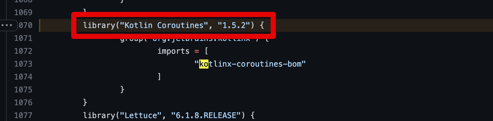
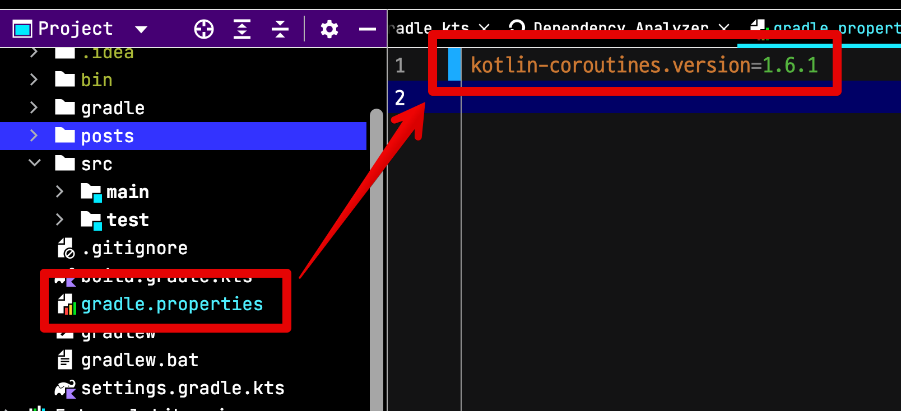

# Kotest 적용시 NoClassDefFound - kotlinx/coroutines/test/TestDispatcher 문제 발생시

## 문제

* SpringBoot: `2.6.7`
* Kotest: `5.3.0`

환경으로 테스트를 수행하면 다음과 같이 에러가 발생한다.

```java
java.lang.NoClassDefFoundError: kotlinx/coroutines/test/TestDispatcher
        at io.kotest.engine.test.interceptors.CoroutineDispatcherFactoryInterceptor.intercept(coroutineDispatcherFactoryInterceptor.kt:40)
        at io.kotest.engine.test.TestCaseExecutor$execute$2$1.invokeSuspend(TestCaseExecutor.kt:78)
        at io.kotest.engine.test.TestCaseExecutor$execute$2$1.invoke(TestCaseExecutor.kt)
        at io.kotest.engine.test.TestCaseExecutor$execute$2$1.invoke(TestCaseExecutor.kt)
```

## 이유



## 해결




**gradle.properties**

```kotlin
kotlin-coroutines.version=1.6.1
```

* https://github.com/kotest/kotest/issues/2782#issuecomment-1016466398
